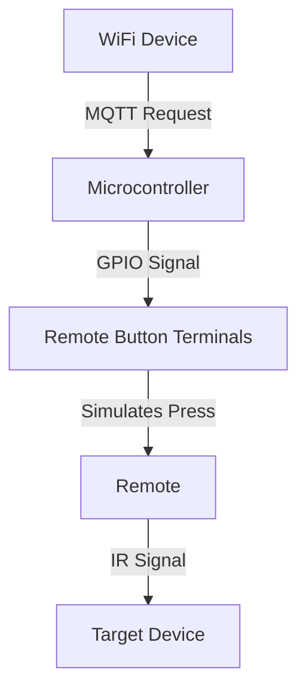

# Smart SOMFY AMY Remote

A compact Arduino sketch for a MakerGO ESP32 C3 SuperMini remote that connects to WiFi, maintains MQTT communication, and exchanges remote-control messages.

## What it does
- Connects to WiFi and keeps the connection alive
- Sets up MQTT publish/subscribe communication
- Publishes status data and handles remote commands

## Project files
- [smart_somfy_amy_remote.ino](smart_somfy_amy_remote.ino): main sketch with setup and loop
- [wifi_module.ino](wifi_module.ino): WiFi setup and connection maintenance
- [mqtt_pubsub_module.ino](mqtt_pubsub_module.ino): MQTT logic
- [remote_module.ino](remote_module.ino): remote-control behavior
- [Common.h](Common.h): shared macros and helpers

## Build notes
- Target board: ESP32 C3 SuperMini
- Required libraries: PubSubClient, WiFi, and Wire
- Configure WiFi and MQTT settings in [Secrets.h](Secrets.h)

---
---

# High-Level Design: MQTT-Controlled Remote Emulator

---

## **1. Overview**
**Objective**: Enable remote control of an existing Remote via WiFi by simulating button presses using a microcontroller.

**Scope**:
- Use a microcontroller (e.g., ESP8266/ESP32) to emulate button presses on a 3.3V Remote.
- Expose a WiFi interface to trigger button presses remotely.
- Share a common **3.3V power source** and **GND** between the microcontroller and the remote.

---

## **2. System Architecture**

### **2.1 Components**
| Component          | Role                                                                 |
|--------------------|----------------------------------------------------------------------|
| Remote          | Target device to control (3.3V, shared GND/VCC).                   |
| Microcontroller    | ESP8266/ESP32 (WiFi-enabled, 3.3V logic).                           |
| Power Source       | 5V supply (shared for both remote and microcontroller) with 3.3V step down circuit.  |
| Mqtt/WiFi Network       | Enables remote triggering of button presses.                       |

### **2.2 High-Level Workflow**

---

## **3. Design Decisions**

### **3.1 Button Press Simulation**
- **Direct GPIO Connection**:
  - Microcontroller GPIO pins connect directly to one terminal of each remote button.
  - Shared **GND** and **3.3V** between microcontroller and remote.
- **Press Types**:
  - **Short Press**: 100–200 ms GPIO activation.
  - **Long Press**: 500 ms–2 s GPIO activation.

### **3.2 WiFi Interface**
- **MQTT Server**: Microcontroller hosts a simple MQTT server.
- **Endpoints**: Each button has a dedicated endpoint (e.g., `/power`, `/volumeUp`).
- **Request Handling**: Triggers GPIO activation to simulate the corresponding button press.

---
## **4. Key Interfaces**

### **4.1 Hardware Interfaces**
| Interface               | Description                                                                 |
|-------------------------|-----------------------------------------------------------------------------|
| Microcontroller GPIO    | Connected to remote button terminals (1 pin per button).                 |
| Shared 3.3V/GND         | Powers both the microcontroller and the remote.                           |

### **4.2 Software Interfaces**
| Interface               | Description                                                                 |
|-------------------------|-----------------------------------------------------------------------------|
| MQTT Endpoints          | `/<button_name>` (e.g., `/power`) to trigger a button press.              |
| GPIO Control            | Microcontroller sets GPIO pins to `LOW`/`HIGH` to simulate presses.      |

---
## **5. Assumptions and Constraints**
- **Assumptions**:
  - Remote buttons are **pull-down** or **pull-up** to GND/3.3V.
  - Microcontroller and remote share the same **3.3V** and **GND**.
  - No need for isolation (transistors/optocouplers) due to shared power.

- **Constraints**:
  - Microcontroller must support WiFi (e.g., ESP8266/ESP32).
  - Remote must operate at **3.3V**.

---
